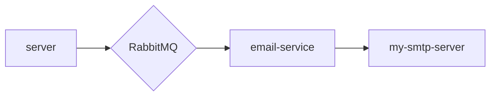

# NodeJS-Email-Microservices

## Notes

1. Copy `.env.example` to `.env`
2. `docker compose up -d rabbitmq`
3. `docker compose up` - NOTE: After rabbitmq starts
4. Hit following URL in browser or curl
   - `curl http://localhost:8000/ -v`
   - `http://localhost:8000/send-mail/?to=ram@test.com&subject=Test&message=HelloWorld`
5. `docker compose down`

## References

- https://github.com/nodemailer/nodemailer-amqp-example
- https://nodemailer.com/about/

## Flow Chart

