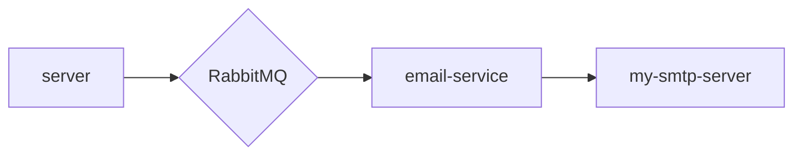

# ExpressJS-Email-Microservices

## Notes

- `curl http://localhost:8000/send-mail/?to=admin@test.com  -v`
- `http://localhost:8000/send-mail/?to=sachin@test.com&subject=TEST1&message=HelloWorlds`

```sh
docker tag <Existing_Name> <username>/<New_Name>:tag

docker push <Image_Name>
```

- References
  - https://github.com/nodemailer/nodemailer-amqp-example
  - https://nodemailer.com/about/

## Flow Chart


