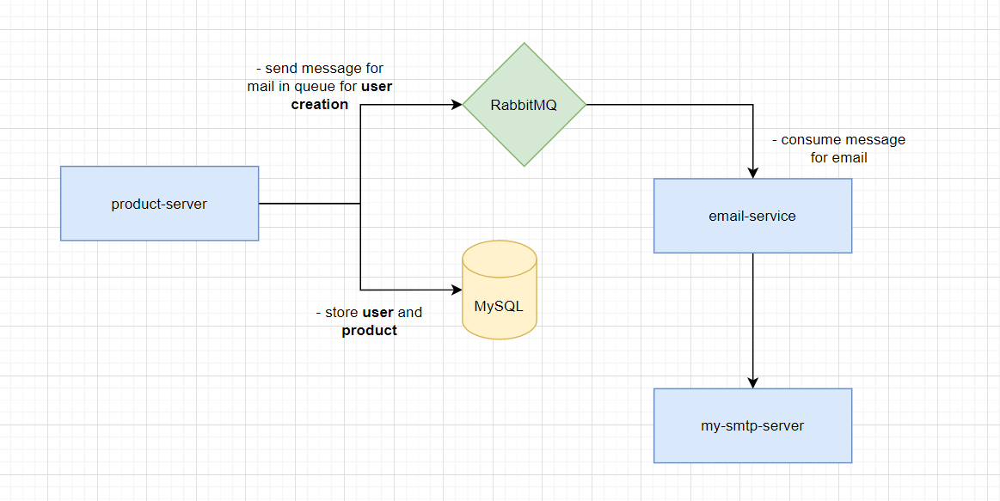

# Product Micro-Services

## Notes

```sh
# - Create Folder for docker data
mkdir -p docker-data/mysql_data

# To run in development mode
docker-compose -f docker-compose.yml -f docker-compose.dev.yml up -d

# To create images for Production
docker-compose -f docker-compose.yml -f docker-compose.build.yml up -d

# To run production images
docker-compose -f docker-compose.yml -f docker-compose.prod.yml up -d

# To stop and remove active containers
docker-compose -f docker-compose.yml -f docker-compose.<>.yml down

# To see logs
docker-compose -f docker-compose.yml -f docker-compose.<>.yml logs -f <SERVICE_NAME>

# Migration Command
npx ts-node -r tsconfig-paths/register ./node_modules/typeorm/cli.js migration:show

# To tag the docker image
docker tag <Existing_Name> <username>/<New_Name>:tag

# To push the image to docker hub
docker push <Image_Name>
```

## References

- https://typeorm.io/
- https://joi.dev/api/?v=17.6.0
- https://www.npmjs.com/package/dotenv
- https://github.com/nodemailer/nodemailer-amqp-example
- https://nodemailer.com/about/
- https://typeorm.io/validation

## Flow Chart


